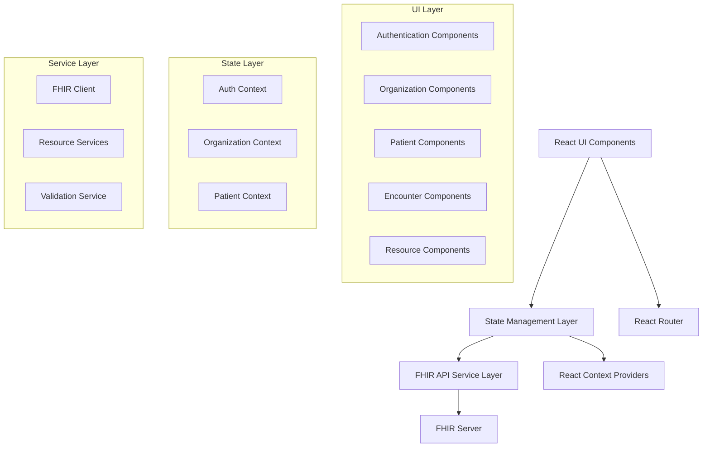

# Design Document

## Overview

The FHIR Resource Visualizer is a React-based single-page application built with TypeScript and Vite. The application follows a component-based architecture with centralized state management using React Context API. The design emphasizes modularity, reusability, and maintainability while providing an intuitive user experience for healthcare professionals working with FHIR data.

The application integrates directly with FHIR R4 servers using RESTful APIs and provides rich visualizations for various healthcare resources. The design supports multi-tenancy through organization selection and multi-patient workflows through a tabbed interface.

## Architecture

### High-Level Architecture



### Technology Stack

- **Frontend Framework**: React 19.1.1 with TypeScript
- **Build Tool**: Vite 7.1.2
- **Styling**: CSS Modules with modern CSS features
- **State Management**: React Context API with useReducer
- **Routing**: React Router v6
- **HTTP Client**: Fetch API with custom FHIR client wrapper
- **UI Components**: Custom component library with accessibility focus
- **Testing**: Vitest with React Testing Library
- **Type Safety**: TypeScript with strict mode enabled

## Components and Interfaces

### Core Application Structure

```typescript
// Main application structure
App
├── AuthProvider
├── OrganizationProvider
├── PatientProvider
├── Router
    ├── LoginPage
    ├── MainLayout
        ├── OrganizationModal
        ├── PatientSearch
        ├── TabManager
            └── PatientTab[]
                ├── PatientHeader
                ├── EncounterTimeline
                ├── EncounterDetails
                └── ResourceViewer
```

### Key Component Interfaces

#### Authentication Components
```typescript
interface LoginPageProps {
  onLogin: (credentials: LoginCredentials) => void;
}

interface AuthContextValue {
  isAuthenticated: boolean;
  user: User | null;
  login: (credentials: LoginCredentials) => Promise<void>;
  logout: () => void;
}
```

#### Organization Components
```typescript
interface OrganizationModalProps {
  isOpen: boolean;
  organizations: Organization[];
  currentOrg: Organization | null;
  onSelect: (org: Organization) => void;
  onClose: () => void;
}

interface OrganizationContextValue {
  currentOrganization: Organization | null;
  organizations: Organization[];
  selectOrganization: (org: Organization) => void;
  fetchOrganizations: () => Promise<void>;
}
```

#### Patient Management Components
```typescript
interface PatientSearchProps {
  onPatientSelect: (patient: Patient) => void;
  onCreatePatient: () => void;
}

interface PatientTabProps {
  patient: Patient;
  isActive: boolean;
  onClose: () => void;
}

interface PatientContextValue {
  openPatients: Map<string, Patient>;
  activePatientId: string | null;
  openPatient: (patient: Patient) => void;
  closePatient: (patientId: string) => void;
  setActivePatient: (patientId: string) => void;
}
```

#### Encounter and Resource Components
```typescript
interface EncounterTimelineProps {
  patientId: string;
  encounters: Encounter[];
  onEncounterSelect: (encounter: Encounter) => void;
  onCreateEncounter: () => void;
}

interface ResourceViewerProps {
  resource: FHIRResource;
  resourceType: ResourceType;
  viewMode: 'summary' | 'detailed';
}
```

### FHIR Service Interfaces

```typescript
interface FHIRClientConfig {
  baseUrl: string;
  organizationId?: string;
  headers?: Record<string, string>;
}

interface FHIRClient {
  searchPatients(query: PatientSearchQuery): Promise<Bundle<Patient>>;
  getPatient(id: string): Promise<Patient>;
  createPatient(patient: Patient): Promise<Patient>;
  getEncounters(patientId: string): Promise<Bundle<Encounter>>;
  createEncounter(encounter: Encounter): Promise<Encounter>;
  getResource<T extends FHIRResource>(resourceType: string, id: string): Promise<T>;
  createResource<T extends FHIRResource>(resource: T): Promise<T>;
}
```

## Data Models

### Core FHIR Resource Types

```typescript
// Base FHIR Resource
interface FHIRResource {
  resourceType: string;
  id?: string;
  meta?: Meta;
  identifier?: Identifier[];
  text?: Narrative;
}

// Patient Resource
interface Patient extends FHIRResource {
  resourceType: 'Patient';
  name?: HumanName[];
  gender?: 'male' | 'female' | 'other' | 'unknown';
  birthDate?: string;
  address?: Address[];
  telecom?: ContactPoint[];
  managingOrganization?: Reference;
}

// Encounter Resource
interface Encounter extends FHIRResource {
  resourceType: 'Encounter';
  status: 'planned' | 'arrived' | 'triaged' | 'in-progress' | 'onleave' | 'finished' | 'cancelled';
  class: Coding;
  subject: Reference; // Patient
  period?: Period;
  reasonCode?: CodeableConcept[];
  diagnosis?: EncounterDiagnosis[];
}

// Observation Resource
interface Observation extends FHIRResource {
  resourceType: 'Observation';
  status: 'registered' | 'preliminary' | 'final' | 'amended' | 'corrected' | 'cancelled';
  code: CodeableConcept;
  subject: Reference; // Patient
  encounter?: Reference;
  valueQuantity?: Quantity;
  valueString?: string;
  valueBoolean?: boolean;
  component?: ObservationComponent[];
}
```

### Application State Models

```typescript
interface AppState {
  auth: AuthState;
  organization: OrganizationState;
  patients: PatientState;
  ui: UIState;
}

interface AuthState {
  isAuthenticated: boolean;
  user: User | null;
  loading: boolean;
  error: string | null;
}

interface OrganizationState {
  current: Organization | null;
  available: Organization[];
  modalOpen: boolean;
  loading: boolean;
}

interface PatientState {
  openPatients: Map<string, PatientData>;
  activePatientId: string | null;
  searchResults: Patient[];
  searchLoading: boolean;
}

interface PatientData {
  patient: Patient;
  encounters: Encounter[];
  resources: Map<string, FHIRResource[]>;
  loading: boolean;
  error: string | null;
}
```

## Error Handling

### Error Boundary Strategy

```typescript
interface ErrorBoundaryState {
  hasError: boolean;
  error: Error | null;
  errorInfo: ErrorInfo | null;
}

// Global error boundary for unhandled errors
class GlobalErrorBoundary extends Component<Props, ErrorBoundaryState>

// Feature-specific error boundaries
class PatientErrorBoundary extends Component<Props, ErrorBoundaryState>
class EncounterErrorBoundary extends Component<Props, ErrorBoundaryState>
```

### FHIR API Error Handling

```typescript
interface FHIRError {
  resourceType: 'OperationOutcome';
  issue: OperationOutcomeIssue[];
}

interface ErrorHandlingStrategy {
  // Network errors
  handleNetworkError(error: NetworkError): void;
  
  // FHIR server errors
  handleFHIRError(error: FHIRError): void;
  
  // Validation errors
  handleValidationError(error: ValidationError): void;
  
  // Authentication errors
  handleAuthError(error: AuthError): void;
}
```

### User-Friendly Error Display

- **Toast Notifications**: For non-critical errors and success messages
- **Inline Error Messages**: For form validation and field-specific errors
- **Error Pages**: For critical application errors
- **Retry Mechanisms**: For network-related failures
- **Graceful Degradation**: Fallback UI when features are unavailable

## Testing Strategy

### Unit Testing

```typescript
// Component testing with React Testing Library
describe('PatientSearch', () => {
  it('should search patients when query is entered', async () => {
    // Test implementation
  });
  
  it('should handle search errors gracefully', async () => {
    // Test implementation
  });
});

// Service testing
describe('FHIRClient', () => {
  it('should fetch patient data correctly', async () => {
    // Test implementation
  });
  
  it('should handle FHIR server errors', async () => {
    // Test implementation
  });
});
```

### Integration Testing

```typescript
// End-to-end user workflows
describe('Patient Management Workflow', () => {
  it('should allow user to search, select, and view patient details', async () => {
    // Test complete user journey
  });
  
  it('should support multi-patient tab management', async () => {
    // Test tab functionality
  });
});
```

### FHIR Resource Validation Testing

```typescript
describe('FHIR Resource Validation', () => {
  it('should validate Patient resources against FHIR R4 schema', () => {
    // Schema validation tests
  });
  
  it('should handle invalid FHIR resources gracefully', () => {
    // Error handling tests
  });
});
```

### Accessibility Testing

- **Screen Reader Compatibility**: ARIA labels and semantic HTML
- **Keyboard Navigation**: Full keyboard accessibility
- **Color Contrast**: WCAG 2.1 AA compliance
- **Focus Management**: Proper focus handling in modals and tabs

### Performance Testing

- **Bundle Size Analysis**: Webpack bundle analyzer
- **Render Performance**: React DevTools Profiler
- **API Response Times**: Network performance monitoring
- **Memory Usage**: Memory leak detection

## Resource Visualization Design

### Observation Visualization

```typescript
interface ObservationVisualization {
  // Numeric values with trend charts
  renderQuantityObservation(obs: Observation): JSX.Element;
  
  // Categorical values with status indicators
  renderCodedObservation(obs: Observation): JSX.Element;
  
  // Multi-component observations (e.g., blood pressure)
  renderComponentObservation(obs: Observation): JSX.Element;
}
```

### Timeline Visualization

```typescript
interface TimelineVisualization {
  // Chronological encounter display
  renderEncounterTimeline(encounters: Encounter[]): JSX.Element;
  
  // Resource timeline within encounters
  renderResourceTimeline(resources: FHIRResource[]): JSX.Element;
  
  // Interactive timeline navigation
  renderTimelineControls(): JSX.Element;
}
```

### Resource-Specific Visualizations

- **Conditions**: Status badges, severity indicators, onset/resolution dates
- **Medications**: Dosage charts, administration schedules, interaction warnings
- **Diagnostic Reports**: Structured result displays, reference range indicators
- **Procedures**: Step-by-step procedure details, outcome summaries

## Security Considerations

### Authentication & Authorization

- **Fake Authentication**: Development-only login bypass
- **Session Management**: Secure session handling for production
- **Role-Based Access**: Organization-based data access control
- **Token Management**: FHIR server authentication token handling

### Data Protection

- **HIPAA Compliance**: Healthcare data protection measures
- **Data Encryption**: In-transit and at-rest encryption
- **Audit Logging**: User action tracking for compliance
- **Data Minimization**: Only fetch required patient data

### Client-Side Security

- **XSS Prevention**: Input sanitization and CSP headers
- **CSRF Protection**: Request validation and tokens
- **Secure Communication**: HTTPS-only API communication
- **Sensitive Data Handling**: No persistent storage of PHI