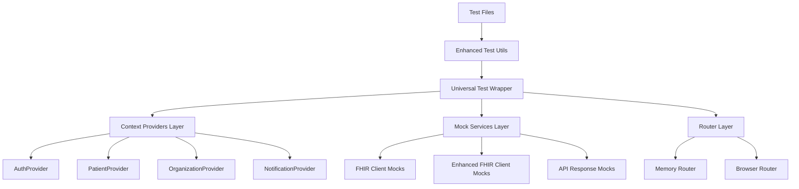
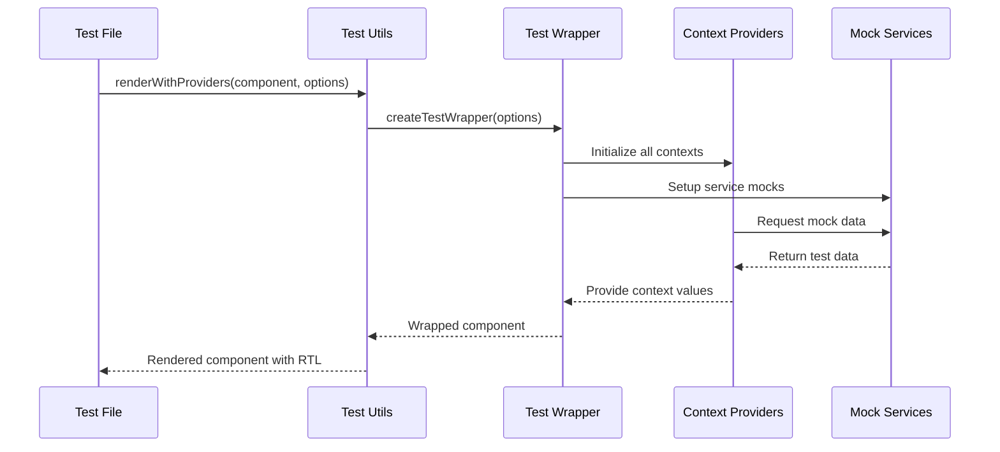

# Design Document

## Overview

This design establishes a comprehensive test infrastructure improvement for the FHIR Health UI application. The solution addresses four critical areas: context provider management, FHIR client mocking, element selection reliability, and asynchronous operation handling. The design leverages the existing Vite testing framework and builds upon the current test-utils.tsx foundation while addressing PowerShell execution policy constraints.

## Architecture

### Test Infrastructure Layers



### Component Integration Flow



## Components and Interfaces

### Enhanced Test Wrapper System

**Core Interface:**
```typescript
interface EnhancedTestWrapperOptions {
  // Router configuration
  routing?: {
    initialEntries?: string[];
    useMemoryRouter?: boolean;
  };
  
  // Authentication state
  auth?: {
    isAuthenticated?: boolean;
    user?: User | null;
    permissions?: string[];
  };
  
  // Organization context
  organization?: {
    current?: Organization | null;
    available?: Organization[];
    loading?: boolean;
  };
  
  // Patient context
  patient?: {
    openPatients?: Map<string, Patient>;
    activePatientId?: string | null;
    loading?: boolean;
  };
  
  // Notification system
  notifications?: {
    messages?: NotificationMessage[];
    maxMessages?: number;
  };
  
  // Mock configurations
  mocks?: {
    fhirClient?: Partial<FhirClientMock>;
    enhancedClient?: Partial<EnhancedFhirClientMock>;
    apiResponses?: Record<string, any>;
  };
  
  // Test environment
  environment?: {
    isOffline?: boolean;
    networkDelay?: number;
    errorSimulation?: boolean;
  };
}
```

### FHIR Client Mock System

**Complete Mock Interface:**
```typescript
interface CompleteFhirClientMock {
  // Patient operations
  searchPatients: MockFunction;
  getPatient: MockFunction;
  createPatient: MockFunction;
  updatePatient: MockFunction;
  deletePatient: MockFunction;
  
  // Organization operations
  searchOrganizations: MockFunction;
  getOrganization: MockFunction;
  setOrganization: MockFunction;
  
  // Encounter operations
  searchEncounters: MockFunction;
  getPatientEncounters: MockFunction;
  createEncounter: MockFunction;
  updateEncounter: MockFunction;
  
  // Resource operations
  createResource: MockFunction;
  updateResource: MockFunction;
  deleteResource: MockFunction;
  searchResource: MockFunction;
  
  // Clinical data operations
  searchObservations: MockFunction;
  searchConditions: MockFunction;
  searchMedicationRequests: MockFunction;
  searchDiagnosticReports: MockFunction;
  searchProcedures: MockFunction;
  
  // Utility operations
  validateResource: MockFunction;
  bundleResources: MockFunction;
}
```

### Element Selection Strategy

**Selector Priority System:**
1. **Test IDs** (highest priority): `data-testid` attributes
2. **Semantic Roles**: ARIA roles and semantic HTML
3. **Accessible Names**: `aria-label`, `aria-labelledby`
4. **Form Labels**: Associated label elements
5. **Text Content** (lowest priority): Visible text with specificity

**Selection Utilities:**
```typescript
interface ElementSelectors {
  // High-specificity selectors
  byTestId: (id: string) => HTMLElement;
  byRole: (role: string, options?: ByRoleOptions) => HTMLElement;
  byLabelText: (text: string | RegExp) => HTMLElement;
  
  // Contextual selectors
  byRoleInContainer: (container: HTMLElement, role: string) => HTMLElement;
  byTextInSection: (section: string, text: string) => HTMLElement;
  
  // Multi-element handlers
  getAllByRoleWithFilter: (role: string, filter: (el: HTMLElement) => boolean) => HTMLElement[];
  getFirstByRole: (role: string) => HTMLElement;
  getNthByRole: (role: string, index: number) => HTMLElement;
}
```

### Async Operation Management

**Timeout Configuration:**
```typescript
interface AsyncTestConfig {
  // Operation-specific timeouts
  timeouts: {
    default: number;
    network: number;
    rendering: number;
    userInteraction: number;
    dataLoading: number;
  };
  
  // Retry configurations
  retries: {
    maxAttempts: number;
    backoffMs: number;
    conditions: string[];
  };
  
  // Wait strategies
  waitStrategies: {
    elementAppearance: WaitForOptions;
    dataLoading: WaitForOptions;
    networkResponse: WaitForOptions;
  };
}
```

## Data Models

### Mock Data Factories

**Patient Data Factory:**
```typescript
interface PatientFactory {
  createBasicPatient: (overrides?: Partial<Patient>) => Patient;
  createPatientWithEncounters: (encounterCount: number) => Patient;
  createPatientWithConditions: (conditions: string[]) => Patient;
  createPatientFamily: (memberCount: number) => Patient[];
}
```

**Organization Data Factory:**
```typescript
interface OrganizationFactory {
  createHealthcareProvider: (overrides?: Partial<Organization>) => Organization;
  createHospitalSystem: (facilityCount: number) => Organization[];
  createClinicNetwork: (locations: string[]) => Organization[];
}
```

**Clinical Data Factory:**
```typescript
interface ClinicalDataFactory {
  createEncounter: (patientId: string, type: string) => Encounter;
  createObservation: (patientId: string, code: string, value: any) => Observation;
  createCondition: (patientId: string, condition: string) => Condition;
  createMedicationRequest: (patientId: string, medication: string) => MedicationRequest;
}
```

## Error Handling

### Test Error Categories

1. **Context Errors**: Missing or misconfigured providers
2. **Mock Errors**: Incomplete or failing mock implementations
3. **Selection Errors**: Element not found or ambiguous selection
4. **Timing Errors**: Async operations timing out or racing
5. **Environment Errors**: PowerShell policy or Vite configuration issues

### Error Recovery Strategies

**Context Error Recovery:**
```typescript
interface ContextErrorHandler {
  detectMissingProvider: (error: Error) => string | null;
  suggestProviderFix: (missingProvider: string) => string;
  autoWrapWithProvider: (component: ReactElement, provider: string) => ReactElement;
}
```

**Mock Error Recovery:**
```typescript
interface MockErrorHandler {
  detectMissingMethod: (error: Error) => string | null;
  createFallbackMock: (methodName: string) => MockFunction;
  logMockUsage: (methodName: string, args: any[]) => void;
}
```

## Testing Strategy

### Test Categories and Approaches

1. **Unit Tests**: Individual components with minimal context
2. **Integration Tests**: Components with full provider context
3. **E2E Tests**: Complete user workflows
4. **Mock Tests**: Service layer and API interaction validation

### Test Execution Strategy

**PowerShell Policy Workaround:**
- Use direct `npx` commands instead of npm scripts
- Implement batch file wrappers for complex commands
- Utilize Vite's programmatic API for test execution

**Parallel Test Execution:**
```typescript
interface TestExecutionConfig {
  parallel: boolean;
  maxWorkers: number;
  testTimeout: number;
  setupTimeout: number;
  teardownTimeout: number;
}
```

### Coverage and Quality Metrics

**Coverage Targets:**
- Unit Tests: 90% line coverage
- Integration Tests: 80% feature coverage
- E2E Tests: 100% critical path coverage

**Quality Gates:**
- Zero context provider errors
- Zero mock method missing errors
- Maximum 5% flaky test rate
- Average test execution under 30 seconds

## Implementation Phases

### Phase 1: Context Provider Infrastructure
- Create universal test wrapper with all providers
- Implement provider configuration options
- Add context state management for tests
- Update existing failing tests to use new wrapper

### Phase 2: Complete Mock Implementation
- Extend FHIR client mocks with missing methods
- Implement enhanced FHIR client mocks
- Create mock data factories
- Add network simulation capabilities

### Phase 3: Element Selection Enhancement
- Implement selector utility functions
- Add test-id attributes to components
- Create element selection best practices guide
- Update tests to use improved selectors

### Phase 4: Async Operation Optimization
- Configure appropriate timeouts for different operations
- Implement retry mechanisms for flaky operations
- Add async operation debugging utilities
- Optimize test execution performance