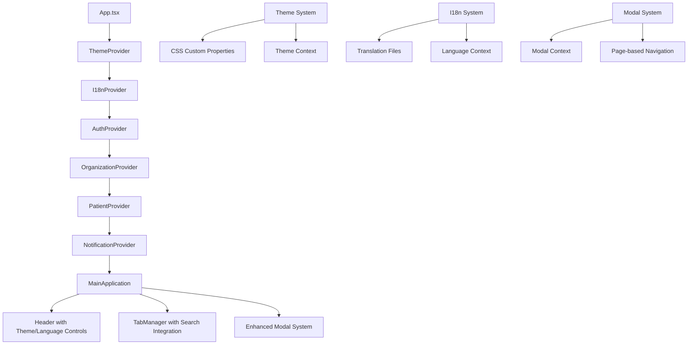

# Design Document

## Overview

This design document outlines the comprehensive UI/UX improvements for the FHIR resource visualizer application. The improvements focus on creating a modern, accessible, and responsive interface that maximizes screen real estate, provides smooth user interactions, and supports multiple languages and themes.

The design leverages the existing React + TypeScript architecture while introducing new systems for theming, internationalization, and enhanced responsive behavior. The application will maintain its current component-based structure while adding new context providers and utility systems to support the enhanced functionality.

## Architecture

### High-Level Architecture Changes



### New Context Providers

1. **ThemeProvider**: Manages light/dark theme state and CSS custom properties
2. **I18nProvider**: Handles language switching and translation loading
3. **ModalProvider**: Manages modal state and page-based navigation within modals

### Enhanced Existing Systems

1. **PatientProvider**: Extended to support patient search functionality
2. **CSS Architecture**: Migrated to CSS custom properties for theming
3. **Responsive System**: Enhanced with full-viewport layouts and custom scrollbars

## Components and Interfaces

### Theme System

#### ThemeContext Interface
```typescript
interface ThemeContextType {
  theme: 'light' | 'dark';
  toggleTheme: () => void;
  setTheme: (theme: 'light' | 'dark') => void;
}
```

#### Theme Configuration
```typescript
interface ThemeConfig {
  light: {
    primary: '#DDF4E7';
    secondary: '#67C090';
    accent: '#26667F';
    dark: '#124170';
  };
  dark: {
    primary: '#210F37';
    secondary: '#4F1C51';
    accent: '#A55B4B';
    light: '#DCA06D';
  };
}
```

### Internationalization System

#### I18nContext Interface
```typescript
interface I18nContextType {
  language: string;
  setLanguage: (lang: string) => void;
  t: (key: string, params?: Record<string, string>) => string;
  availableLanguages: Language[];
}

interface Language {
  code: string;
  name: string;
  nativeName: string;
}
```

#### Translation Structure
```typescript
interface TranslationKeys {
  common: {
    save: string;
    cancel: string;
    delete: string;
    edit: string;
    search: string;
    loading: string;
  };
  patient: {
    createPatient: string;
    searchPatient: string;
    patientDetails: string;
    // ... more patient-related keys
  };
  // ... other feature areas
}
```

### Enhanced Modal System

#### ModalContext Interface
```typescript
interface ModalContextType {
  openModal: (modalId: string, config: ModalConfig) => void;
  closeModal: (modalId: string) => void;
  navigateToPage: (modalId: string, pageId: string, data?: any) => void;
  goBack: (modalId: string) => void;
  activeModals: Map<string, ModalState>;
}

interface ModalConfig {
  size: 'small' | 'medium' | 'large' | 'fullscreen';
  pages: ModalPage[];
  initialPage: string;
  onClose?: () => void;
}

interface ModalPage {
  id: string;
  title: string;
  component: React.ComponentType<any>;
  canGoBack?: boolean;
}
```

### Enhanced Patient Management

#### Extended PatientContext Interface
```typescript
interface PatientContextType extends ExistingPatientContext {
  searchPatients: (query: string) => Promise<Patient[]>;
  searchResults: Patient[];
  searchLoading: boolean;
  searchError: string | null;
  openPatientFromSearch: (patient: Patient) => void;
}
```

### Responsive Layout System

#### Viewport Detection Hook
```typescript
interface ViewportInfo {
  width: number;
  height: number;
  isMobile: boolean;
  isTablet: boolean;
  isDesktop: boolean;
}

function useViewport(): ViewportInfo;
```

#### Layout Configuration
```typescript
interface LayoutConfig {
  fullViewport: boolean;
  customScrollbars: boolean;
  mobileScrollBehavior: 'native' | 'custom';
  tabletScrollBehavior: 'native' | 'custom';
  desktopScrollBehavior: 'custom';
}
```

## Data Models

### Theme Data Model
```typescript
interface ThemeState {
  currentTheme: 'light' | 'dark';
  systemPreference: 'light' | 'dark';
  userPreference: 'light' | 'dark' | 'system';
  isSystemThemeSupported: boolean;
}
```

### I18n Data Model
```typescript
interface I18nState {
  currentLanguage: string;
  loadedLanguages: Set<string>;
  translations: Record<string, TranslationKeys>;
  fallbackLanguage: string;
  isLoading: boolean;
  error: string | null;
}
```

### Modal Navigation State
```typescript
interface ModalState {
  id: string;
  isOpen: boolean;
  currentPage: string;
  pageHistory: string[];
  pageData: Record<string, any>;
  config: ModalConfig;
}
```

## Error Handling

### Theme System Error Handling
- Graceful fallback to light theme if theme detection fails
- CSS custom property fallbacks for unsupported browsers
- Local storage error handling for theme persistence

### I18n Error Handling
- Fallback to default language if translation loading fails
- Key fallback system (show key if translation missing)
- Graceful handling of malformed translation files

### Modal System Error Handling
- Automatic modal cleanup on navigation errors
- Page navigation error boundaries
- State recovery mechanisms for interrupted modal flows

### Responsive Layout Error Handling
- Viewport detection fallbacks
- CSS feature detection for custom scrollbars
- Progressive enhancement for advanced layout features

## Testing Strategy

### Unit Testing
- Theme context provider functionality
- I18n translation key resolution
- Modal navigation state management
- Responsive layout hook behavior
- Patient search functionality

### Integration Testing
- Theme switching across components
- Language switching with persistent state
- Modal page navigation flows
- Patient search and tab opening workflow
- Responsive behavior across breakpoints

### Visual Regression Testing
- Theme consistency across all components
- Modal sizing and positioning
- Responsive layout behavior
- Custom scrollbar styling
- Typography and spacing in different languages

### Accessibility Testing
- Keyboard navigation in enhanced modals
- Screen reader compatibility with theme changes
- Focus management during language switching
- Color contrast validation for both themes
- Touch target sizing on mobile devices

### Performance Testing
- Theme switching performance
- Translation loading and caching
- Modal rendering performance
- Scroll performance with custom scrollbars
- Memory usage with multiple patient tabs

### Cross-Browser Testing
- CSS custom properties support
- Custom scrollbar rendering
- Responsive layout behavior
- Theme detection accuracy
- Local storage functionality

## Implementation Considerations

### CSS Architecture Migration
- Migrate from static CSS to CSS custom properties
- Implement CSS-in-JS solution for dynamic theming
- Create design token system for consistent spacing and typography
- Establish responsive breakpoint system

### Performance Optimization
- Lazy load translation files
- Implement theme switching without flash of unstyled content
- Optimize modal rendering with React.memo
- Use CSS containment for scroll performance

### Browser Compatibility
- Provide fallbacks for CSS custom properties (IE11 support if needed)
- Implement custom scrollbar fallbacks for Firefox
- Ensure responsive layout works across all target browsers
- Test theme detection across different operating systems

### Accessibility Compliance
- Maintain WCAG 2.1 AA compliance
- Implement proper ARIA labels for new components
- Ensure keyboard navigation works with enhanced modals
- Provide high contrast theme variants if needed

### Migration Strategy
- Implement new systems alongside existing ones
- Gradual migration of components to new theme system
- Feature flags for new functionality during development
- Backward compatibility during transition period